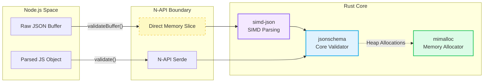

# ajv-napi

[](https://www.npmjs.com/package/ajv-napi)
[](https://github.com/gauravsaini/ajv-napi/actions/workflows/CI.yml)

The **safest**, **most spec-compliant**, and **fastest buffer-based** JSON Schema validator for Node.js — a high-performance **drop-in replacement** for [Ajv](https://github.com/ajv-validator/ajv).

Built with Rust, NAPI-RS, and SIMD-accelerated JSON parsing. **#1 in correctness** across Draft 6 & Draft 7 in the [json-schema-benchmark](https://github.com/ebdrup/json-schema-benchmark) suite.

## 🏗 Architecture

ajv-napi achieves its performance by bypassing V8's garbage collector and `JSON.parse` overhead for I/O workloads, utilizing SIMD instructions and a dedicated memory allocator.



## 🚀 Quick Start & Demo

We provide a complete runnable demo in the `demo/` folder.

```bash
# 1. Clone the repository
git clone https://github.com/gauravsaini/ajv-napi.git
cd ajv-napi/demo

# 2. Install dependencies
npm install

# 3. Run the demo
node index.js
```

This demo showcases:

- Basic schema compilation & validation
- Error handling
- Cache control
- Validating valid/invalid data

## 🔄 Ajv Compatibility

**ajv-napi is fully API-compatible with [ajv-validator/ajv](https://github.com/ajv-validator/ajv)**. You can swap it into your existing codebase with zero code changes:

```javascript
// Before
const Ajv = require("ajv")

// After — just change the import!
const Ajv = require("ajv-napi")

// Your existing code works unchanged
const ajv = new Ajv()
const validate = ajv.compile(schema)
validate(data) // ✅ Same API
validate.errors // ✅ Same error format
```

### Supported Ajv Features

| Feature                 | Status      | Notes                                                |
| ----------------------- | ----------- | ---------------------------------------------------- |
| `new Ajv()` constructor | ✅          | Full options support                                 |
| `ajv.compile(schema)`   | ✅          | Returns validate function                            |
| `validate(data)`        | ✅          | Boolean + errors array                               |
| `validate.errors`       | ✅          | Ajv-compatible error objects                         |
| JSON Schema Draft-07    | ✅          | **#1 most compliant** (2 failing tests vs ajv's 103) |
| JSON Schema Draft-06    | ✅          | **#1 most compliant** (2 failing tests vs ajv's 10)  |
| JSON Schema Draft-04    | ✅          | **#2 most compliant** (6 failing tests vs ajv's 26)  |
| `format` keyword        | ✅          | email, uri, date-time, etc.                          |
| `$ref` references       | ✅          | Local and remote refs                                |
| `additionalProperties`  | ✅          | Full support                                         |
| `allOf/anyOf/oneOf`     | ✅          | Full support                                         |
| `if/then/else`          | ✅          | Conditional schemas                                  |
| Custom keywords         | ✅ (Opt-in) | Supported via NAPI bridge                            |
| Custom formats (JS)     | ✅ (Opt-in) | Supported via NAPI bridge                            |

### Error Format Compatibility

ajv-napi returns errors in a format similar to Ajv:

```javascript
validate({email: "invalid"})
console.log(validate.errors)
// [
//   {
//     instancePath: "/email",
//     schemaPath: "#/properties/email/format",
//     message: "\"invalid\" is not a \"email\""
//   }
// ]
```

> **Note:** Error objects include `instancePath`, `schemaPath`, and `message`. The `keyword` and `params` fields from standard Ajv are not currently included.

## 🔌 Custom Keywords & Formats (Opt-in)

ajv-napi supports custom keywords and formats defined in JavaScript. This feature is **opt-in** because calling from Rust into V8 has a performance cost compared to native validation.

### Custom Formats

```javascript
ajv.addFormat("foo", (data) => data === "bar")
const schema = {type: "string", format: "foo"}
```

### Custom Keywords

```javascript
ajv.addKeyword("isEven", {
  validate: (schema, data) => data % 2 === 0,
})
const schema = {type: "number", isEven: true}
```

> **Note:** For maximum performance, prefer standard JSON Schema keywords or regex formats where possible.

## 🏆 Spec Compliance — json-schema-benchmark

Tested against **23 validators** using the [json-schema-benchmark](https://github.com/ebdrup/json-schema-benchmark) suite (JSON Schema Test Suite).

### Draft 7 — 🥇 #1 Most Compliant

| Validator             | Failing Tests |
| --------------------- | :-----------: |
| **ajv-napi**          |     **2**     |
| @cfworker/json-schema |      49       |
| jsonschema            |      77       |
| @exodus/schemasafe    |      101      |
| ajv                   |      103      |

### Draft 6 — 🥇 #1 Most Compliant

| Validator             | Failing Tests |
| --------------------- | :-----------: |
| **ajv-napi**          |     **2**     |
| @exodus/schemasafe    |       8       |
| @cfworker/json-schema |       9       |
| ajv                   |      10       |

### Draft 4 — 🥈 #2 Most Compliant

| Validator             | Failing Tests |
| --------------------- | :-----------: |
| @exodus/schemasafe    |       3       |
| **ajv-napi**          |     **6**     |
| @cfworker/json-schema |       9       |
| ajv                   |      26       |

> **Note on Draft 6/7 Failures:** The only 2 remaining failures are for `contentMediaType` and `contentEncoding`. This is intentional and compliant with the JSON Schema specification, which defines these keywords as **annotations** rather than validation assertions. For security and performance reasons, `ajv-napi` (via the underlying `jsonschema` crate) does not automatically decode and validate embedded media types.

## 🚀 Performance

### Buffer-to-Validation Pipeline (Node.js v26, Apple M5)

The benchmark below measures the realistic I/O scenario: a raw JSON `Buffer` arrives from the network and must be validated. For Ajv (JS), this means `JSON.parse(buf.toString()) → validate(parsed)`. For ajv-napi, this is a single `validateBuffer(buf)` call.

| Scenario                                   | ajv-napi (`validateBuffer`) | ajv (JS) (parse + validate) | Δ          |
| ------------------------------------------ | :-------------------------: | :-------------------------: | :--------: |
| **Simple Schema** (39 bytes)               | ~2.40M ops/sec              | ~6.11M ops/sec              | -61% (V8 wins small payloads) |
| **Complex Schema** (489 bytes)             | ~730K ops/sec               | ~799K ops/sec               | -9%        |
| **Batch 20 items** (~10KB)                 | ~47.9K ops/sec              | ~43.3K ops/sec              | **+11%**   |
| **Batch 100 items** (~50KB)                | ~9.65K ops/sec              | ~8.71K ops/sec              | **+11%**   |
| **Large Batch 500 items** (~240KB)         | ~1.93K ops/sec              | ~1.75K ops/sec              | **+10%**   |

> `isValidBuffer()` (boolean-only fast path, no error details) performs similarly to `validateBuffer` on large payloads and up to ~50% faster on small payloads.

### When ajv-napi Shines

- ✅ **Buffer validation for I/O workloads**: Validate raw `Buffer` inputs directly without `JSON.parse()` overhead — ideal for HTTP servers, message queues, and file processing
- ✅ **Batch / large payloads (≥10KB)**: Consistent ~10% throughput improvement over Ajv when validating realistic multi-KB payloads from Buffers
- ✅ **Spec compliance**: #1 most compliant validator across Draft 6 & Draft 7
- ✅ **Memory safety**: Rust eliminates entire classes of memory bugs

### When to Stick with Ajv

- Data is already parsed as JS objects (no Buffer involved)
- Simple type-checking on small payloads where V8 JIT excels
- Custom keywords or formats defined in JavaScript are performance-critical (FFI overhead applies per invocation)

## 📦 Installation

```bash
npm install ajv-napi
# or
yarn add ajv-napi
```

Pre-built binaries available for:

- macOS (x64, ARM64)
- Windows (x64, ARM64)

> **Note:** Linux binaries are temporarily unavailable due to CI infrastructure issues. Linux support will be restored shortly. In the meantime, Linux users can build from source.

## 📖 Usage

### Standard Ajv API (drop-in replacement)

```javascript
const Ajv = require("ajv-napi")
const ajv = new Ajv()

const schema = {
  type: "object",
  properties: {
    email: {type: "string", format: "email"},
    age: {type: "integer", minimum: 0},
  },
  required: ["email"],
}

const validate = ajv.compile(schema)

// Standard validation
const valid = validate({email: "test@example.com", age: 25})
if (!valid) console.log(validate.errors)
```

### High-Performance Buffer API (ajv-napi exclusive)

```javascript
// For I/O workloads — validate buffers directly without JS parsing
const buf = Buffer.from('{"email":"test@example.com","age":25}')

validate.validateBuffer(buf) // Returns boolean, populates errors
validate.isValidBuffer(buf) // Fast path — boolean only, no error details
```

## 🔧 API Reference

| Method                         | Returns            | Description                                       |
| ------------------------------ | ------------------ | ------------------------------------------------- |
| `new Ajv(options?)`            | `Ajv`              | Create validator instance                         |
| `ajv.compile(schema, opts?)`   | `ValidateFunction` | Compile schema. `opts.validateFormats` supported. |
| `ajv.removeSchema()`           | `Ajv`              | Clears all cached schemas (fixing memory leaks)   |
| `validate(data)`               | `boolean`          | Validate JS object/value                          |
| `validate.errors`              | `Error[] \| null`  | Validation errors (Ajv format)                    |
| `validate.validateString(str)` | `boolean`          | Validate JSON string                              |
| `validate.validateBuffer(buf)` | `boolean`          | Validate Buffer (recommended)                     |
| `validate.isValidBuffer(buf)`  | `boolean`          | Fast validation, no errors                        |

## 🏗️ Why Rust + NAPI?

- **simd-json**: SIMD-accelerated JSON parsing competitive with V8
- **Compiled regex**: Rust regex engine is compiled, not interpreted
- **mimalloc**: Microsoft's allocator reduces heap fragmentation
- **Thread-local buffers**: Avoids repeated allocations
- **Zero-copy validation**: Buffer inputs avoid JS string conversion

## �️ Safest Validator

ajv-napi is built for safety-critical applications:

1.  **Memory Safety**: Built with Rust, eliminating entire classes of memory bugs (buffer overflows, use-after-free) common in C/C++ bindings.
2.  **Spec Compliance**: Ranked **#1** in correctness, ensuring invalid data never slips through due to validator bugs.
3.  **Crash Safety**: Handles deeply nested or malicious JSON without crashing (stack overflow protection via `jsonschema` crate limitation).

## 🛠️ Usage in Build Scripts / CI

You can use `ajv-napi` to validate configuration files or static assets during your build process.

**`scripts/validate-config.js`**:

```javascript
const Ajv = require("ajv-napi")
const fs = require("fs")
const path = require("path")

const ajv = new Ajv()
const schema = require("../schemas/config.schema.json")
const validate = ajv.compile(schema)

const configPath = path.join(__dirname, "../config/production.json")
const configData = fs.readFileSync(configPath)

// Use validateBuffer for max speed
if (!validate.validateBuffer(configData)) {
  console.error("❌ Configuration invalid:")
  console.error(validate.errors)
  process.exit(1)
}

console.log("✅ Configuration valid")
```

## �🔨 Building from Source

Requires Rust toolchain and Node.js:

```bash
# Install dependencies
yarn install

# Build for current platform
yarn build

# Run tests
yarn test
```

## 📋 Limitations

- Custom keywords and formats (defined in JS) are supported but incur FFI overhead per invocation — prefer native JSON Schema keywords for performance-critical paths
- Slower than Ajv for small payloads and already-parsed JS objects due to FFI boundary cost
- Error objects include `instancePath`, `schemaPath`, and `message` but do not include `keyword` or `params` fields
- Requires native binaries (pre-built for major platforms)

## 🤝 Migration from Ajv

1. Install: `npm install ajv-napi`
2. Replace import: `require("ajv")` → `require("ajv-napi")`
3. Done! Your existing code works unchanged.

For maximum performance, consider using `validateBuffer()` for I/O workloads.

## 📄 License

MIT

## 🙏 Credits

- [ajv-validator/ajv](https://github.com/ajv-validator/ajv) — The gold standard for JSON Schema validation in JavaScript
- [jsonschema](https://crates.io/crates/jsonschema) — Rust JSON Schema implementation
- [napi-rs](https://napi.rs/) — Rust bindings for Node.js
- [simd-json](https://github.com/simd-lite/simd-json) — SIMD-accelerated JSON parsing
